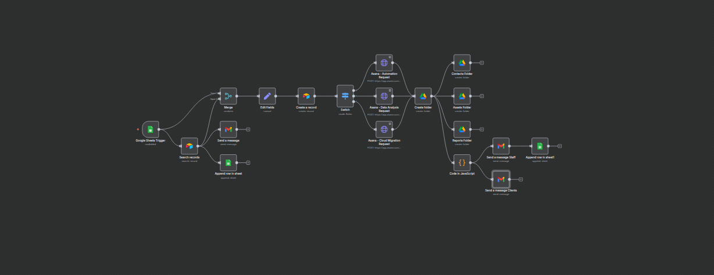

# 🚀 Client Onboarding Workflow

The **Client Onboarding Workflow** is an automation that allows users to **quickly streamline their new clients project on boarded.** It eliminates repetitive tasks like folder creation, email notifications, and spreadsheet logging—tasks that are time-consuming and prone to error when handled manually.

Consultancy businesses & freelancers handling projects in Automation, Data Analysis, or Cloud Migration.

---

## 🗂️ Category

**Operations**

---

## 💡 Benefits of this workflow

- **Reduce admin overhead** Triggering on new
- **Ensures Consistency**
- **Enhances the client experience**
- **Consistent folder structures**Ensures consistency & professional delivery
- **Automated, personalized communication**

---

## ⚙️ How It Works

1. **Trigger** → Google Sheets Trigger detects a new onboarding record.
2. **Data Staging** → Airtable Search node checks for duplicates.
3. **Project Creation** → Switch node directs to the correct Asana project (Automation, Data Analysis, or Cloud Migration).
4. **Folder Creation** → Google Drive node builds a client folder + subfolders (Contracts, Assets, Reports).
5. **Email Notification** → Gmail node sends a welcome email with links.
6. **Logging** → Google Sheets logs key details (Timestamp, Email, Project).

🔗 **Logic/Dependencies**: Switch node ensures only the relevant Asana node executes.

---

## 🛠️ Setup in 12 Steps

- **Integrations**:

  - Google OAuth2 (Drive, Sheets, Gmail)
  - Asana PAT
  - Airtable API key

- **Steps**:
  1. Prepare Google Sheets with "Client Onboarding" & "Onboarding" tabs.
  2. Configure workflow with credentials.
  3. Test Asana & Airtable connections.

🔒 **Note**: Exclude PII (tokens, secrets) in shared setups.

---

## ⚠️ Limitations

- Gmail rate-limited (500/day)
- Paid n8n Cloud or self-hosting required for high volume
- Asana PAT requires periodic renewal

---

## 📌 Version & Updates

- **v1.0** (2025-09-30): Initial release – Full onboarding automation (Google, Asana, Airtable).
- **v1.1** [Future]: Add Slack notifications + minor bug fixes.

---

## 🎥 Demo Video

[[Watch Video] ](https://www.loom.com/share/982b3d443f4349739c99f85ccde9a466?sid=8826bca0-e28b-4ba7-86c0-acdc6f749e4b)

---

## ☎️ Need Help Setting Up Or Customization?

- **Email**: [Send Mail](info@electronicexchange.ng)
- **LinkedIn**: 
- **Twitter(X)**: 
- **Youtube**: 
- **Discord**: 

---

✨ _Automate. Analyze. Amplify._ ✨
