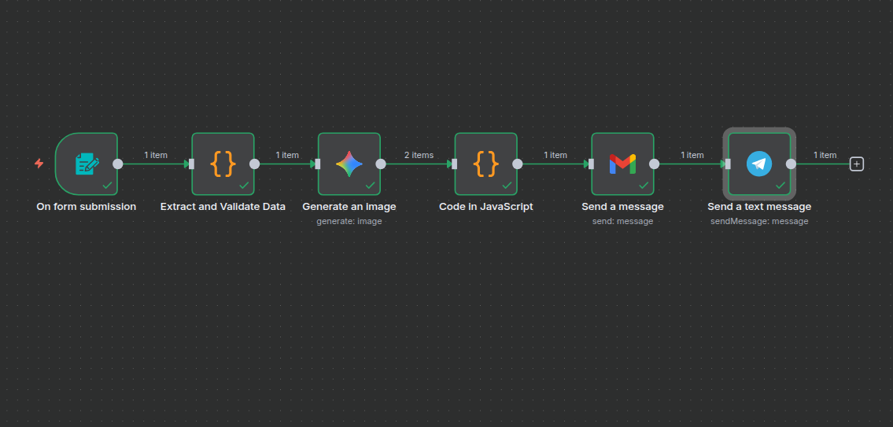

# 🎨 Generate AI Book Covers with Google Gemini & Send via Email V1.1

This workflow allows users to generate **AI-powered book cover designs instantly** using Google Gemini, consolidate them into download links, and deliver them directly to an author’s inbox. The entire process is triggered by a simple **n8n form** that collects book details, including title, subtitle, author, genre, preferred colors, and style.

It automates the cover design process, ensuring **fast, affordable, and professional-quality results** for self-publishers, freelancers, and indie authors.

---

## 🗂️ Category

**Marketing**

---

## 💡 Benefits of this workflow

- **Full Automation**: From prompt creation to email delivery — the workflow runs hands-free once set up.
- **AI-Powered Creativity**: Uses **Google Gemini** to adapt designs dynamically based on title, genre, style, and mood.
- **Instant Delivery**: Sends download links for both covers to the user’s email inbox.
- **Cost & Time Savings**: Skip the high cost per professional design and generate covers in under 2 minutes.
- **Secure**: Uses API-based credentials for Gemini and Gmail to ensure safe communication.

---

## ⚙️ How It Works

- **Trigger**: n8n Form collects inputs via a secure channel
- **Validate**: Ensures required fields are clean and assigned values
- **Generate**: A precrafted prompt with validated details is sent to Gemini for generating images
- **Upload**: Generated images are uploaded to Google Drive
- **Consolidate**: Uploaded image URLs and metadata packed together
- **Send**: Gmail sends links to inputed emaill address
- **Notify**: A meesage with links is sent to admins chatbot on Telegram

---

## 🛠️ Setup in 5 Steps

1. **Setup Gemini API:** Get Google AI Studio API key and setup a credential [Learn how Here](https://docs.n8n.io/integrations/builtin/credentials/googleai/#using-geminipalm-api-key)
2. **Setup Google Drive API:** Setup Google Auth in Google Console [Learn how Here](https://docs.n8n.io/integrations/builtin/credentials/google/oauth-single-service/)
3. **Setup Email Credential:** Setup Google Credential for Gmail [Learn how Here](https://docs.n8n.io/integrations/builtin/credentials/google/oauth-single-service/)
4. **Setup Telegram Bot:** Setup Telegram Bot with API Bot access token [Learn how Here](https://docs.n8n.io/integrations/builtin/credentials/telegram/#prerequisites)
5. **Run the workflow:** Execute the workflow and an n8n form window opens for inputs.

---

## ⚠️ Limitations

- _LLM Cost:_ Google Gemini API incurs per-image costs (~$0.04 each)
- _Temporayr Binary Data:_ n8n’s binary download links may expire or need authentication
- _Basic form validation only:_ complex rules require extra logic
- _Restriction on Links:_ Some email clients may block external links

---

## 📌 Version

- **v1.0**: Initial release (Form → Gemini → Gmail)
- **v1.1**: Fixed email delivery with consolidated URLs

---

## 🎥 Demo Video

[[Watch Video] ](https://www.loom.com/)

---

## ☎️ Need Help Setting Up Or Customization?

- **Email**: [Send Mail](info@electronicexchange.ng)
- **LinkedIn**: 
- **Twitter(X)**: 
- **Youtube**: 
- **Discord**: 

---

✨ _Automate. Analyze. Amplify._ ✨
